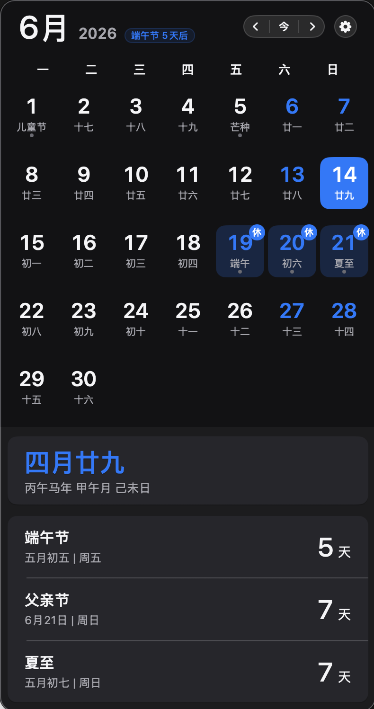

# Tic

[](https://github.com/NicCraver/tic/actions/workflows/ci.yml)


开源的 macOS 菜单栏日历：状态栏显示日期/农历/时间，点击弹出月历，一眼看清节气、法定节假日与调休。

<!-- 截图占位：补充后取消注释


-->

## 功能

- **模块化菜单栏**：日期、星期、周数、农历、时间、图标可单独开关与排序
- **农历月历弹窗**：公历网格 + 农历、二十四节气、休/班标注、节日倒计时
- **法定调休**：内置 2024–2026 年国务院放假安排（数据来自 [holiday-cn](https://github.com/NateScarlet/holiday-cn)，随版本发版更新）
- **完整设置**：通用 / 外观 / 菜单栏 / 日历 / 快捷键 / 关于
- **检查更新**：每天本地时间 10:00 自动检查并提醒；也可手动查询 GitHub Releases，在浏览器打开下载页
- 主题跟随系统或浅色/深色；支持登录时自动启动；无 Dock 图标（纯菜单栏应用）

## 下载

[Releases](https://github.com/NicCraver/tic/releases) 提供 `.dmg`（**Apple Silicon / arm64**，macOS 14+）。打开镜像后将 **Tic** 拖入 **Applications** 即可。

> **首次打开提示「已损坏」或无法验证开发者？** 这是 Gatekeeper 拦截未公证应用，并非文件损坏。任选其一：
>
> 1. 在 DMG 内 **右键 `Tic.app` → 打开**（首次确认后拖入 Applications）；或
> 2. 终端清除隔离属性：
>
>    ```bash
>    xattr -cr /Applications/Tic.app
>    open /Applications/Tic.app
>    ```
>
> Intel Mac 请 [从源码构建](#从源码构建)。

## 快捷键（日历弹窗内）

| 按键 | 作用 |
|------|------|
| `←` `→` | 前一天 / 后一天 |
| `↑` `↓` | 上一周 / 下一周 |
| `⌥` `←` `→` | 上一月 / 下一月 |
| `⌘` `,` | 打开设置 |

全局唤起日历快捷键尚未提供，见 [已知限制](#已知限制)。

## 隐私

- **无埋点、无崩溃上报、无账号体系**
- **日常使用完全离线**（农历、节气、内置调休数据均本地计算/读取）
- **检查更新**：每天 **10:00**（系统本地时区）后台查询 GitHub Releases API；启动时若错过今日场次会补检。有新版本时弹窗提醒，点「稍后」则同一版本不再自动打扰。菜单或 **设置 → 关于** 可随时手动检查。不上传任何用户信息
- 点击 **反馈与问题 / 开源仓库** 会在浏览器打开 GitHub（用户主动操作）

## 已知限制

- 预编译 Release 为 **arm64**，Intel 需自行编译
- 当前 Release **未 Apple 公证**，首次打开需按上文处理 Gatekeeper
- 内置调休数据覆盖 **2024–2026**；2027 年及以后需等待新版本发版（国务院公布后维护者更新内置 JSON）
- **全局快捷键**（任意界面唤起日历）计划在后续版本提供

## 从源码构建

**要求：** macOS 14+、Xcode 16+（Swift 6）

```bash
git clone https://github.com/NicCraver/tic.git
cd tic
brew install xcodegen
xcodegen generate
open Tic.xcodeproj
# Xcode 中 Cmd+R 运行
```

本地测试：

```bash
xcodebuild test -scheme Tic -destination 'platform=macOS' \
  CODE_SIGNING_ALLOWED=NO CODE_SIGN_IDENTITY=-
```

## 技术栈

- Swift 6 + SwiftUI（菜单栏 / 弹层）+ AppKit（设置窗口）
- [LunarSwift](https://github.com/6tail/lunar-swift) — 二十四节气、日干支
- [holiday-cn](https://github.com/NateScarlet/holiday-cn) — 法定节假日 / 调休数据
- XcodeGen

实现细节见 [`docs/date-holiday-logic.md`](docs/date-holiday-logic.md)；节假日数据源见 [`docs/holiday-data-source.md`](docs/holiday-data-source.md)。

## 参与贡献

欢迎 Issue 与 PR。请先阅读 [CONTRIBUTING.md](CONTRIBUTING.md)。发版流程见 [docs/releasing.md](docs/releasing.md)。

## 反馈与安全

- [提交 Issue](https://github.com/NicCraver/tic/issues)
- 安全问题见 [SECURITY.md](SECURITY.md)

## License

MIT — 见 [LICENSE](LICENSE)。
