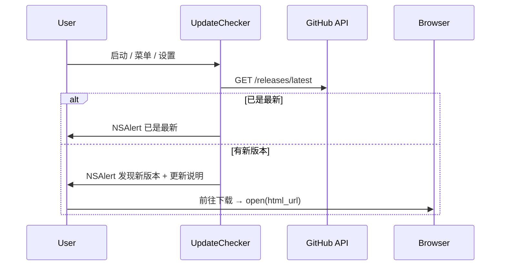

# 检查更新方案（手动 + 浏览器下载）

> 背景：Tic 通过 GitHub Releases 分发 DMG。应用**不**应用内下载安装包；作为常驻菜单栏应用，每天在**本地时间 10:00**静默检查 GitHub API，有新版本时弹窗提醒，用户在浏览器自行下载。也可从菜单 / 设置手动检查。

## 实现状态（2026-06-12，已落地）

核心代码位于 [`Tic/Sources/Update/`](../Tic/Sources/Update/)：

| 文件 | 职责 |
|------|------|
| [`UpdateService.swift`](../Tic/Sources/Update/UpdateService.swift) | 调用 GitHub `/releases/latest` API，SemVer 比较 |
| [`UpdateChecker.swift`](../Tic/Sources/Update/UpdateChecker.swift) | 手动检查编排；菜单通知入口 |
| [`UpdatePrompt.swift`](../Tic/Sources/Update/UpdatePrompt.swift) | 检查中浮层；`NSAlert` 已最新 / 有新版本 / 失败 |
| [`ReleaseNotesFormatter.swift`](../Tic/Sources/Update/ReleaseNotesFormatter.swift) | Release body 轻量 Markdown → 纯文本 |

发版与 CI 见 [`docs/releasing.md`](releasing.md)。

## 设计原则

1. **自动提醒**：每天 **10:00**（系统本地时区）由一次性 `Timer` 触发，结束后调度次日 10:00（`RunLoop.common`，常驻不重启也生效）。启动约 2 秒后若今日 10:00 已过且尚未检查、或距上次查询超过 24 小时，则补检一次。仅在有新版本时弹窗，已是最新或失败时**静默**。
2. **稍后不再打扰**：自动提醒里点「稍后」会记住该版本号，同一版本不再自动弹窗（手动检查仍会提示）。
3. **浏览器下载**：点「前往下载」打开 `release.htmlURL`，用户在浏览器下载 DMG 并拖入「应用程序」。
4. **手动检查**：菜单 / 设置触发，显示检查浮层；已最新或失败均弹窗反馈。
5. **失败可兜底**：手动检查失败时提供「打开 Releases」跳转固定列表页。

## 用户流程

### 入口

- **应用菜单**：`TicApp` → `检查更新…` → `Notification.Name.checkForUpdates`
- **设置 → 关于**：`UpdateChecker.shared.checkManually()`
- **自动检查调度**：`AppDelegate` → `beginAutomaticUpdateChecks()`（每日 10:00 定时器 + 启动补检）

## 版本比较与 API

- **当前版本**：`Bundle.main` 的 `CFBundleShortVersionString`（与 `project.yml` 中 `MARKETING_VERSION` 一致）
- **最新版本**：GitHub `tag_name` 去 `v` 前缀后 SemVer 比较（`UpdateService.isNewer`）
- **API**：`https://api.github.com/repos/NicCraver/tic/releases/latest`
- **请求头**：`Accept: application/vnd.github+json`，`User-Agent: Tic/{version}`
- **响应上限**：512KB
- **错误**：403/429 视为限流；仅手动检查时弹窗

## 配置

| 项 | 值 |
|----|-----|
| 自动检查时刻 | 每天 10:00（`Calendar.autoupdatingCurrent`，随 macOS 系统时区；改时区后自动重算下次触发） |
| 启动补检 | 今日 10:00 后未检查，或距上次查询 ≥ 24 小时 |
| UserDefaults | `me.nic.tic.lastUpdateCheckTime`、`me.nic.tic.dismissedUpdateVersion` |
| Releases 列表页 | `https://github.com/NicCraver/tic/releases` |
| Logger | `me.nic.tic` / `UpdateService` |

## 踩坑与约束

| 问题 | 说明 |
|------|------|
| 不能自动替换正在运行的 app | 用户须从 DMG 拖入「应用程序」 |
| GitHub API 限流 | 未认证请求有频率限制；失败时可手动打开 Releases |
| 检查浮层时序 | 先 `UpdateCheckingIndicator.dismiss()` 再 `NSAlert` |

## 改相关功能前

- 动检查更新逻辑：读本文 + [`UpdateChecker.swift`](../Tic/Sources/Update/UpdateChecker.swift)
- 动发版 / DMG：读 [`releasing.md`](releasing.md)

## 历史说明

2026-06-10 之前曾实现应用内 DMG 下载（`UpdateDownloadManager`、`TrustedDownloadPolicy` 等），已于 2026-06-12 移除，改为浏览器下载，以配合离线优先产品方向。
