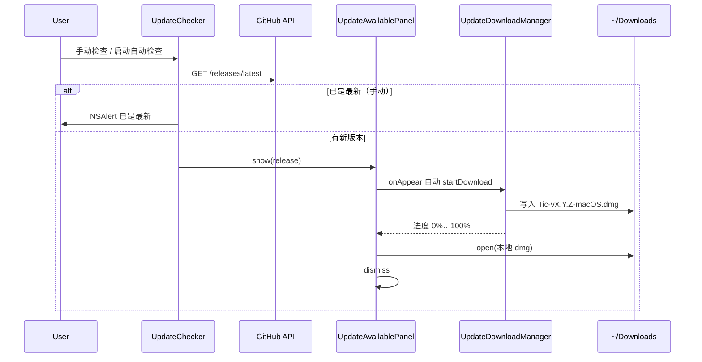

# 应用内检查更新与 DMG 下载方案

> 背景：Tic 通过 GitHub Releases 分发 DMG。用户不应被跳转到浏览器下载；发现新版本后应在应用内展示更新面板、自动下载安装包并显示进度，下载完成后自动打开 DMG 镜像完成手动拖放安装。
>
> 参考实现风格：MarkMark 等菜单栏应用的「Update Available」面板（安装说明 + 进度条 + 取消）。

## 实现状态（2026-06-10，已落地）

核心代码位于 [`Tic/Sources/Update/`](../Tic/Sources/Update/)：

| 文件 | 职责 |
|------|------|
| [`UpdateService.swift`](../Tic/Sources/Update/UpdateService.swift) | 调用 GitHub `/releases/latest` API，解析 tag、Release 说明、DMG `browser_download_url`，SemVer 比较 |
| [`UpdateChecker.swift`](../Tic/Sources/Update/UpdateChecker.swift) | 手动 / 自动检查编排；节流；弹出更新面板或「已是最新」 |
| [`UpdateAvailableView.swift`](../Tic/Sources/Update/UpdateAvailableView.swift) | SwiftUI 更新面板 + `UpdateAvailablePanel`（`NSPanel` 宿主） |
| [`UpdateDownloadManager.swift`](../Tic/Sources/Update/UpdateDownloadManager.swift) | `URLSessionDownloadDelegate` 应用内下载，进度回调 |
| [`UpdatePrompt.swift`](../Tic/Sources/Update/UpdatePrompt.swift) | 检查中浮层 `UpdateCheckingIndicator`；`NSAlert` 已最新 / 失败 |
| [`ReleaseNotesFormatter.swift`](../Tic/Sources/Update/ReleaseNotesFormatter.swift) | 将 Release body 中 `### Added` 等 Markdown 标题转为可读纯文本 |

发版与 CI 见 [`docs/releasing.md`](releasing.md)；GitHub Actions [`.github/workflows/release.yml`](../.github/workflows/release.yml) 在推送 `v*` tag 时构建 DMG 并创建 Release。

## 设计原则

1. **不打开浏览器**：DMG 通过 `URLSession` 下载到用户「下载」文件夹，不用 `NSWorkspace.open(远程 URL)`。
2. **下载完直接打开**：完成后 `NSWorkspace.shared.open(本地 dmg 路径)` 挂载镜像，用户拖入「应用程序」；面板自动关闭。
3. **面板出现即开始下载**：无需再点「下载更新」；下载中仅保留「取消」，失败后可「重试」。
4. **静默自动检查**：启动后每 24 小时最多检查一次；有新版本时弹出面板（与手动检查行为一致）。
5. **手动检查有反馈**：设置「关于」或应用菜单「检查更新…」时显示「正在检查更新…」浮层，结果前必须先 `dismiss` 浮层，避免与结果弹窗叠在一起。
6. **Release 说明来自 CHANGELOG**：CI 从 `CHANGELOG.md` 对应版本节提取正文写入 GitHub Release；客户端用 `ReleaseNotesFormatter` 做轻量格式化展示。

## 用户流程



### 入口

- **应用菜单**：`TicApp` 中 `CommandGroup(after: .appInfo)` → 发送 `Notification.Name.checkForUpdates`
- **设置 → 关于**：`AboutSettingsViewController` → `UpdateChecker.shared.checkManually()`
- **启动自动检查**：`AppDelegate.applicationDidFinishLaunching` → `checkAutomaticallyIfNeeded()`

### 更新面板 UI（`UpdateAvailableView`）

- 标题「发现新版本」、版本号、橙色「需手动安装」徽章
- **安装说明**（固定文案）：下载后自动打开 DMG、拖入应用程序、Gatekeeper / `xattr` 提示
- **更新内容**：来自 GitHub Release `body`（经 `ReleaseNotesFormatter`）
- **进度**：文案 + 线性进度条 + 百分比
- **按钮**：下载中「取消」；失败时「稍后」「重试」

面板由 `UpdateAvailablePanel` 以 `NSPanel`（`floating`、`closable`）承载 `NSHostingController`，居中显示。

## 版本比较与 API

- **当前版本**：`Bundle.main` 的 `CFBundleShortVersionString`，与 `project.yml` 中 `MARKETING_VERSION` 一致。
- **最新版本**：GitHub `tag_name`（如 `v1.2.4`），去掉前缀 `v` 后与当前版本按 **SemVer 数字段**逐段比较（`UpdateService.isNewer`）。
- **DMG 选择**：Release `assets` 中**第一个** `*.dmg` 的 `browser_download_url`。
- **API 地址**：`https://api.github.com/repos/NicCraver/tic/releases/latest`
- **请求头**：`Accept: application/vnd.github+json`，`User-Agent: Tic/{version}`
- **错误**：403/429 视为限流；其他非 200 抛 `apiError`；自动检查失败时**静默**（不弹窗），仅手动检查弹错误。

## 下载实现要点

```swift
// 目标路径
let downloadsDir = FileManager.default.urls(for: .downloadsDirectory, in: .userDomainMask).first!
let destination = downloadsDir.appendingPathComponent(dmgURL.lastPathComponent)
// 文件名与 Release 附件一致，如 Tic-v1.2.4-macOS.dmg
```

- 使用独立 `URLSession` + `UpdateDownloadDelegate`，在 `didWriteData` 上报进度。
- `didFinishDownloadingTo` 将临时文件 **move** 到目标路径（已存在则先删除）。
- `didComplete` 用 `didComplete` 标志位防止 continuation **重复 resume**。
- 取消：`downloadTask.cancel()` + `session.invalidateAndCancel()`。

**不要**改回用浏览器打开 `dmgDownloadURL`。

## 发版与客户端联动

维护者流程（详见 [`releasing.md`](releasing.md)）：

1. 在 `CHANGELOG.md` 写清 `[X.Y.Z]` 节（CI 会提取为 Release 正文）。
2. 更新 `project.yml`：`MARKETING_VERSION`、`CURRENT_PROJECT_VERSION`（构建号递增）。
3. `git tag vX.Y.Z && git push origin vX.Y.Z`
4. Actions 产出 `Tic-vX.Y.Z-macOS.dmg` 并挂到 GitHub Release。

客户端下次检查更新时即可发现新版本。DMG 命名须与 workflow 一致：`Tic-${{ github.ref_name }}-macOS.dmg`。

### 测试发版

可像 v1.2.1 / v1.2.4 一样发**仅用于验证更新链路**的小版本：CHANGELOG 注明「测试版本」，用户安装上一正式版后手动「检查更新」验证发现 → 下载 → 打开 DMG 全流程。

## 配置与状态

| 项 | 值 |
|----|-----|
| 自动检查间隔 | 24 小时 |
| UserDefaults 键 | `me.nic.tic.lastUpdateCheckTime`（上次检查时间戳） |
| 下载目录 | 系统「下载」文件夹 |
| Logger 子系统 | `me.nic.tic` / `UpdateService` |

## 安全策略（已落地）

实现于 [`Tic/Sources/Security/TrustedDownloadPolicy.swift`](../Tic/Sources/Security/TrustedDownloadPolicy.swift)：

| 措施 | 说明 |
|------|------|
| DMG URL 白名单 | 仅允许 `https` + `github.com` / `objects.githubusercontent.com`，路径须含 `/NicCraver/tic/releases/download/` |
| 文件名约束 | 必须为 `Tic-v{version}-macOS.dmg`，与 Release `tag_name` 去 `v` 后一致 |
| 重定向拦截 | `URLSessionTaskDelegate` 拒绝跳转到非白名单域名 |
| 落盘路径 | `safeDestinationURL` 防止 `..` 与 Downloads 目录外写入 |
| 体积上限 | DMG ≤ 100MB；GitHub API 响应 ≤ 512KB |
| 下载后校验 | 移动文件后再次校验文件名与体积 |

**尚未覆盖**（需 Apple Developer ID）：DMG 内 `.app` 的代码签名 / 公证校验、Release 附带的 SHA256 校验和。当前 CI 仍为 ad-hoc 签名，见 [`releasing.md`](releasing.md)。

节假日联网数据见 [`holiday-data-source.md`](holiday-data-source.md)：holiday-cn 已 pin 到固定 commit，JSON ≤ 2MB，解析后 `year` 须与请求年份一致。

## 踩坑与约束

| 问题 | 说明 |
|------|------|
| 未公证 / 隔离属性 | Release 为 ad-hoc 签名，用户首次安装或更新后可能需「右键打开」；安装说明面板已提示。避免推广全局 `xattr -cr`。 |
| 不能自动替换正在运行的 app | 菜单栏应用仍须用户从 DMG 拖入「应用程序」；无法像 MAS 那样静默覆盖。 |
| GitHub API 限流 | 未认证请求有频率限制；`User-Agent` 必填。自动检查失败不打扰用户。 |
| 检查浮层时序 | 手动检查时，**先** `UpdateCheckingIndicator.dismiss()` **再** `UpdateAvailablePanel.show()` 或 `NSAlert`，否则浮层会挡住结果。 |
| 面板关闭 | `UpdateAvailablePanel.dismiss()` 会 `cancelDownload()`，避免后台继续下载。 |
| 版本号唯一来源 | 只改 `project.yml`，改后 `xcodegen generate`；不要手改 `Info.plist`。 |

## 改相关功能前

- 动更新 UI / 下载逻辑：先读本文 + [`UpdateAvailableView.swift`](../Tic/Sources/Update/UpdateAvailableView.swift)。
- 动发版 / DMG / Release 正文：读 [`releasing.md`](releasing.md) 与 [`.github/workflows/release.yml`](../.github/workflows/release.yml)。
- **禁止**将更新下载改回 `NSWorkspace.open(远程 dmg URL)` 或纯 `NSAlert` + 外链浏览器方案（除非产品明确要求）。

## 本地验证

```bash
# 编译
scripts/restart-dev.sh

# 模拟：本地 Debug 的 MARKETING_VERSION 低于 GitHub latest 时
# 设置 → 关于 → 检查更新
```

推送 tag 前可用 [`releasing.md`](releasing.md) 中的本地 DMG 脚本试打镜像；端到端更新测试建议安装**上一版 Release DMG** 后再检查更新。
