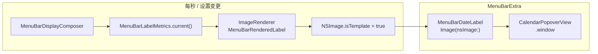

# 菜单栏标签：定宽、防抖动与着色

> 目标：状态栏日期时间**宽度不随秒数变化**、文案在固定槽位内**居中**、颜色随菜单栏/壁纸**自动适配**（与系统图标一致）。

## 当前方案（请以此为准）

`MenuBarExtra` 的 `label` 使用 **`ImageRenderer` 生成固定宽度模板位图**（`NSImage` + `isTemplate`），而不是在 label 里直接摆 `Text` + `.frame`，也不用自建 `NSStatusItem` 自定义绘制。

### 相关文件

| 文件 | 职责 |
|------|------|
| [`MenuBarDateLabel.swift`](../Tic/Sources/MenuBarDateLabel.swift) | `ImageRenderer` 渲染、`Image(.template)` 展示、定时刷新 |
| [`MenuBarLabelMetrics.swift`](../Tic/Sources/MenuBarLabelMetrics.swift) | 当前文案、定宽 `labelWidth` / `textSlotWidth`、刷新间隔 |
| [`MenuBarDisplayComposer.swift`](../Tic/Sources/MenuBarDisplayComposer.swift) | 模块拼接、`widestCompose` / `sizingText`（全 `8` 占位）、量宽、字重 |
| [`TicApp.swift`](../Tic/Sources/TicApp.swift) | `MenuBarExtra` + `.menuBarExtraStyle(.window)` |
| [`MenuBarSettingsPane.swift`](../Tic/Sources/Settings/MenuBarSettingsPane.swift) | 设置变更时 `post(.menuBarSettingsDidChange)` |

### 定宽规则

1. **占位串**：`widestCompose` 得到各模块最宽组合，再 `wideningDigits` 把数字换成 `8`（等宽数字下最宽字形）。
2. **量宽**：`reservedTextWidth(for:)` 对占位串取 `labelFont` / `labelDigitFont` 测量的较大值。
3. **总宽**：`textSlotWidth` +（可选图标 16 + 间距 4）+ `labelHorizontalInset * 2`（当前为 0）。
4. **渲染**：`MenuBarRenderedLabel` 在 `labelWidth` 画布内将**实时** `displayText` 居中；画布宽度不变，故菜单栏项不抖。

### 模板图着色（壁纸 / 深浅色）

位图是「烘焙」出来的，**不能**用 `Color.primary` / `labelColor` 指望系统自动变色。

| 步骤 | 做法 |
|------|------|
| 渲染 | 黑字 + 透明底（`MenuBarTemplateStyle.foreground = .black`） |
| 导出后 | `image.isTemplate = true` |
| SwiftUI | `Image(nsImage:).renderingMode(.template)` |
| 外观切换 | 监听 `AppleInterfaceThemeChangedNotification` 重新 `renderLabelImage()` |

系统会把模板图按当前菜单栏对比度着色（浅壁纸上偏浅、深壁纸上偏深等）。

### 字重与字号

- 字号：`NSFont.menuBarFont(ofSize: 0).pointSize`（跟随系统菜单栏）。
- 字重：`MenuBarDisplayComposer.labelFontWeight`（当前 **`.medium`**）；渲染与量宽须共用 `labelFont()` / `labelDigitFont()`。

---

## 踩坑记录

### 1. `MenuBarExtra` label 里的 `.frame(width:)` / 自定义 `Layout`

**现象**：秒数变化时菜单栏项宽度仍抖动；或设置了 `frame` / `fixedSize` 无效。

**原因**：[Apple 文档](https://developer.apple.com/documentation/swiftui/menubarextra) 中 `MenuBarExtra` 的 label 由系统按**内容固有宽度**布局；`variableLength` 的 `NSStatusItem` 会随 `Text` 变宽变窄。纯 SwiftUI 的定宽修饰符**不能可靠**约束系统菜单栏项占位。

**结论**：需要**固定像素宽度**时，不要指望 label 内直接 `Text` + `.frame`；改用下文「当前方案」。

---

### 2. `ZStack` + 透明占位 `Text("88…")`

**现象**：界面上直接显示一串 `8`，或仍抖动。

**原因**：在 `MenuBarExtra` 里 `opacity(0)` / `.hidden()` 的占位文字**仍可能被绘制**；且系统仍可能按可见层计算宽度。

**结论**：占位 `8` **只用于** `sizingText` 量宽，**不要**放进 view 树渲染。

---

### 3. `Rectangle` 背景 / 左右 padding 调试

**现象**：加了红色背景或 10pt 内边距，菜单栏上看不到，宽度也不变。

**原因**：`MenuBarExtra` label **基本只支持** 简单 `Text`、`Image`（及 SF Symbol）；复杂背景、`Color` 填充常被忽略。

**结论**：调试定宽请用模板图方案稳定后再看效果；不要依赖 label 内背景色验证占位。

---

### 4. 自建 `NSStatusItem` + 自定义 `NSView.draw`

**现象**：菜单栏一块空白（可点击、高亮），**完全没有字**；或只剩一个竖条/单字符。

**原因**：

- 在 `NSStatusBarButton` 上 `addSubview` 自绘时，系统常**只画按钮高亮**，自定义 `draw` 不执行或坐标系错误（`draw(at:)` 的 y 是基线等）。
- `button.title` 与 subview 混用、或 `length` 很大但标题未绘制，会像「空白条」。

**结论**：Tic **不要**再用单独的 `NSStatusItem` 替代 `MenuBarExtra` 做标签。弹层继续用 `MenuBarExtra` + `.window`；定宽标签用 `ImageRenderer`。

---

### 5. `ImageRenderer` 未设模板 → 文字永远黑色

**现象**：位图能显示，但不随壁纸/菜单栏变亮变暗，始终黑字。

**原因**：渲染时用了 `.primary` / `labelColor` 等，颜色被**烤进**位图；未标记 `isTemplate`。

**结论**：黑字透明底 + `isTemplate` + `.renderingMode(.template)`（见上文表格）。

---

### 6. 量宽字体与渲染字体不一致

**现象**：定宽后仍偶发裁切或多余空白。

**原因**：例如量宽用 `menuBarFont`（Regular）、渲染用 `.medium`，或数字未用 `monospacedDigit` 配套字体。

**结论**：`reservedTextWidth`、`MenuBarRenderedLabel`、`labelFontWeight` **同一套** API（`labelFont()` / `labelDigitFont()`）。

---

## 若仍要调研的其他路径

| 方向 | 说明 |
|------|------|
| [MenuBarExtraAccess](https://github.com/orchetect/MenuBarExtraAccess) | 拿到 `MenuBarExtra` 背后的 `NSStatusItem` 设 `length`；多依赖，未采用 |
| 仅 `NSStatusItem` + `button.title` | 可见性在部分环境下仍不如 `MenuBarExtra` + 位图稳定 |
| 每秒 `ImageRenderer` 性能 | 当前 1s 刷新可接受；若改高频注意 CPU |

---

## 参考

- [MenuBarExtra | Apple Developer Documentation](https://developer.apple.com/documentation/swiftui/menubarextra)
- [NSImage.isTemplate | Apple Developer Documentation](https://developer.apple.com/documentation/appkit/nsimage/istemplate)
- [NSStatusItem | Apple Developer Documentation](https://developer.apple.com/documentation/appkit/nsstatusitem)（`variableLength` vs 固定 `length`）
- 社区：MenuBarExtra label 自定义视图宜渲成 `NSImage`（[Stack Overflow](https://stackoverflow.com/questions/77150551/swiftui-menubarextra-with-custom-view-in-menubar-instead-of-just-icon-and-label)）
