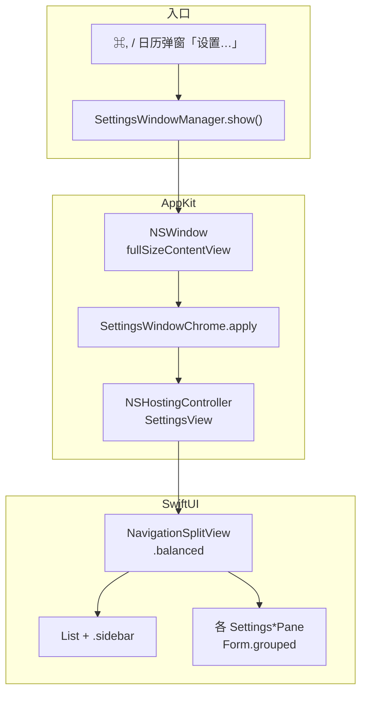

# 设置窗口与全高侧栏实现说明

> 目标：接近 macOS 系统设置 / xCal 的侧栏——毛玻璃材质、交通灯叠在侧栏左上角、选中项内凹圆角高亮。  
> 参考视觉：侧栏全高 + 右侧 `Form(.grouped)` 分组详情。

## 推荐架构（当前采用）

Tic 是 **`LSUIElement` 菜单栏应用**（无 Dock 图标），设置窗口**不能**依赖 SwiftUI 的 `Settings { }` 场景作为主路径，而应使用 **AppKit 窗口 + SwiftUI 内容**。



### 相关文件

| 文件 | 职责 |
|------|------|
| [`SettingsWindowManager.swift`](../Tic/Sources/SettingsWindowManager.swift) | 创建/复用 `NSWindow`，挂载 `NSHostingController` |
| [`SettingsWindowChrome.swift`](../Tic/Sources/Settings/SettingsWindowChrome.swift) | 窗口级 chrome：透明标题栏、toolbar、全高 split |
| [`SettingsView.swift`](../Tic/Sources/SettingsView.swift) | `NavigationSplitView` + 侧栏 `List` + 详情路由 |
| [`SettingsTheme.swift`](../Tic/Sources/Settings/SettingsTheme.swift) | 窗口尺寸、详情区 `SettingsPaneScaffold` |

### SwiftUI 侧栏（内容层）

```swift
NavigationSplitView(columnVisibility: $columnVisibility) {
    List(selection: $selection) { /* Label + tag */ }
        .listStyle(.sidebar)
        .navigationSplitViewColumnWidth(min:ideal:max:)
        .toolbar(removing: .sidebarToggle)
} detail: { /* 各 Pane */ }
.navigationSplitViewStyle(.balanced)
```

- **不要**用手写 `HStack` 拼侧栏：会失去 `List(.sidebar)` 的毛玻璃与系统选中样式，变成纯色块 + 硬分隔线。
- 详情区用 `Form { Section { ... } }.formStyle(.grouped)`，外包 `SettingsPaneScaffold` 大标题。

### AppKit 窗口（chrome 层）

`SettingsWindowChrome.apply` 必须同时配置：

| 配置 | 作用 |
|------|------|
| `styleMask` 含 `.fullSizeContentView` | 内容可画到标题栏区域 |
| `titlebarAppearsTransparent = true` | 透明标题栏 |
| `titleVisibility = .hidden` | 隐藏标题文字（保留无障碍标题） |
| `titlebarSeparatorStyle = .none` | 去掉标题栏底部分隔线 |
| `isMovableByWindowBackground = true` | 可在侧栏空白处拖窗口 |
| `styleMask` **不含** `.resizable` + `minSize`/`maxSize` 相同 | 窗口宽高固定为 `SettingsTheme`（760×520），不可拖拽缩放 |
| `hosting.safeAreaRegions = []` | SwiftUI 不把交通灯区域算进 safe area |
| `NSToolbar` + `.sidebarTrackingSeparator` | 系统把列分隔线画进标题栏，**全高侧栏才生效** |
| `NSSplitViewItem.allowsFullHeightLayout = true` | 侧栏列布局延伸到窗口顶 |

`allowsFullHeightLayout` 需在 **首帧布局后**再设（`DispatchQueue.main.async` 或 `SettingsSplitViewConfigurator`），否则 hierarchy 里还没有 `NSSplitViewController`。

### macOS 15+ 额外修饰

在 `SettingsView` 根视图：

```swift
.toolbarBackgroundVisibility(.hidden, for: .windowToolbar)  // macOS 15+
.toolbar(removing: .title)
```

macOS 14 回退：`.toolbarBackground(.hidden, for: .windowToolbar)`。

---

## 踩坑记录

### 1. `Settings` 场景 + 隐藏 `Window`（菜单栏应用）

**现象**：`NSApplication _crashOnException`，打开设置即崩溃。

**原因**：`LSUIElement` 仅 `MenuBarExtra` 时，再声明 `Window` + `Settings` 场景，环境/窗口生命周期与菜单栏应用不匹配；社区 workaround（隐藏 Window 置于 Settings 前）在部分系统版本仍不稳定。

**结论**：Tic **只用** `SettingsWindowManager` + `NSWindow`，**不要**在 `TicApp` 里加 `Settings { }` 或用于 workaround 的隐藏 `Window`。

---

### 2. 手写 `HStack` 侧栏

**现象**：侧栏变成纯色灰块、竖线硬分隔、无 vibrancy；与 xCal/系统设置差距大。

**原因**：`List(.sidebar)` 的材质和选中绘制依赖 `NavigationSplitView` / `NSSplitView` 的列布局，脱离后只剩普通 `List`。

**结论**：侧栏必须是 `NavigationSplitView` 第一列 + `.listStyle(.sidebar)`。

---

### 3. 仅有 `fullSizeContentView` 仍无全高侧栏

**现象**：交通灯仍在独立标题条里，侧栏从标题栏下方才开始。

**原因**：

- `NSHostingController` 默认 safe area 把内容顶下去；
- 缺少 `NSToolbar` 的 **`sidebarTrackingSeparator`** 时，系统不知道在标题栏内画列分隔线。

**结论**：`safeAreaRegions = []` + tracking separator toolbar **缺一不可**（见 [Paul Bancarel 一文](https://medium.com/@bancarel.paul/macos-full-height-sidebar-window-62a214309a80)、[WWDC20 10104](https://developer.apple.com/videos/play/wwdc2020/10104/)）。

---

### 4. `NavigationSplitView` + `NSHostingController` ≠ `WindowGroup`

同一套 `NavigationSplitView`，用 `WindowGroup` 打开与用手动 `NSWindow` 打开，默认 chrome **不一致**（侧栏折叠、全高、toolbar 行为）。菜单栏应用只能走后者并显式 `SettingsWindowChrome`。

---

### 5. macOS 26 Liquid Glass 浮动侧栏

**现象**：侧栏像圆角卡片浮在窗口上，与「贴边全高」预期不符。

**说明**：macOS 26 上 `NavigationSplitView` 默认可能呈现 Liquid Glass 浮动侧栏；在 **正确配置 chrome** 后，应更接近系统设置。若仍偏浮动，勿再用 `HStack`「修复」，应检查 toolbar / `allowsFullHeightLayout` 是否生效。

---

### 6. API 可用性

| API | 最低版本 |
|-----|----------|
| `toolbarBackgroundVisibility(.hidden, for: .windowToolbar)` | macOS 15 |
| `toolbar(removing: .title)` | macOS 15 |
| `toolbarBackground(.hidden, for: .windowToolbar)` | macOS 14 回退 |
| `safeAreaInset` / `NavigationSplitView` | macOS 14（项目 deployment target） |

---

### 7. 侧栏列表首行与交通灯

列表项应由系统布局在交通灯**下方**；若重叠，微调 inset（历史上曾用 `safeAreaInset(edge: .top)` ~52pt），**不要**给整窗加 `padding.top`（会把右栏详情也顶下去）。

当前依赖 chrome 配置 + 原生 `List` 布局；一般无需额外 top inset。

---

## 修改检查清单

改动设置 UI 前请确认：

- [ ] 仍使用 `SettingsWindowManager`，未改回 `Settings` 场景
- [ ] 侧栏仍为 `NavigationSplitView` + `List(.sidebar)`
- [ ] 新建窗口后调用 `SettingsWindowChrome.apply`
- [ ] 未删除 `sidebarTrackingSeparator` toolbar
- [ ] 未在详情列手动 `Color(nsColor: .windowBackgroundColor)` 盖掉系统背景（除非有明确设计需求）
- [ ] Cmd+, 与弹窗内「设置…」均调用 `SettingsWindowManager.show()`
- [ ] 在 macOS 14 与当前主力系统（如 26）各测一次打开/关闭/切换侧栏项
- [ ] 窗口四角/边缘不可拖拽改变尺寸；最小化 / 最大化按钮可见但禁用（仅关闭可用）

---

## 参考资料

- [Customizing window styles and state restoration (macOS)](https://developer.apple.com/documentation/swiftui/customizing-window-styles-and-state-restoration-behavior-in-macos)
- [macOS full height sidebar window (Medium)](https://medium.com/@bancarel.paul/macos-full-height-sidebar-window-62a214309a80)
- [Showing Settings from Menu Bar Items (steipete)](https://steipete.me/posts/2025/showing-settings-from-macos-menu-bar-items) — 说明 MenuBarExtra 与 `Settings` 场景的限制
- [Adopting Liquid Glass](https://developer.apple.com/documentation/TechnologyOverviews/adopting-liquid-glass) — macOS 26 侧栏/导航行为变化
