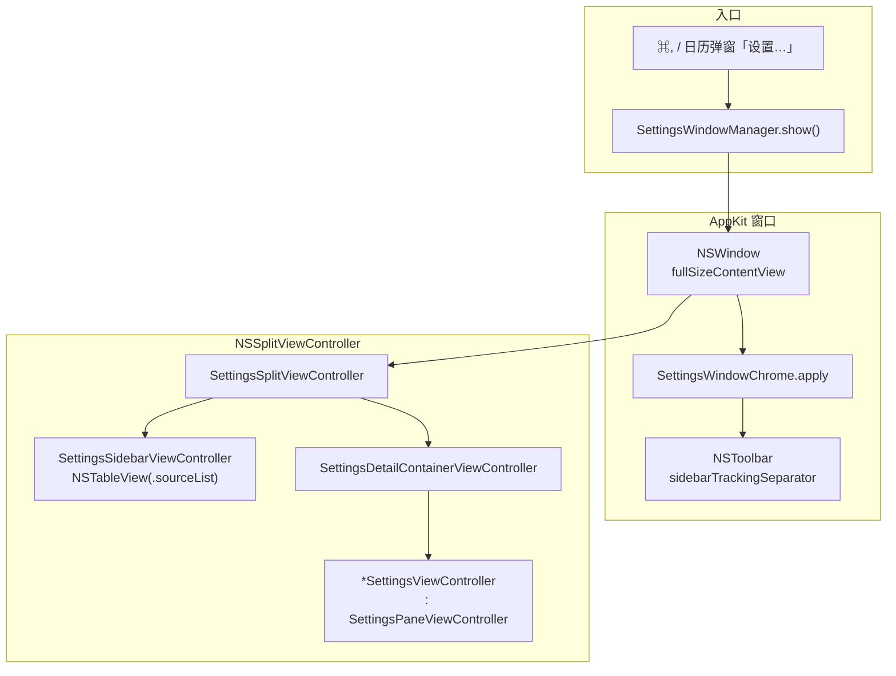

# 设置窗口与全高侧栏实现说明（AppKit）

> 目标：接近 macOS 系统设置的侧栏——全高、毛玻璃材质、交通灯叠在侧栏左上角；右侧大标题 + 分组详情。
> **实现：纯 AppKit**（`NSWindow` + `NSSplitViewController`），不再使用 SwiftUI `NavigationSplitView` / `List(.sidebar)`。

## 架构（当前采用）

Tic 是 **`LSUIElement` 菜单栏应用**（无 Dock 图标），设置窗口**不能**依赖 SwiftUI 的 `Settings { }` 场景，使用 **AppKit 窗口 + AppKit 内容控制器**。

### 相关文件

| 文件 | 职责 |
|------|------|
| [`SettingsWindowManager.swift`](../Tic/Sources/SettingsWindowManager.swift) | 创建/复用 `NSWindow`，`contentViewController = SettingsSplitViewController` |
| [`Settings/SettingsWindowChrome.swift`](../Tic/Sources/Settings/SettingsWindowChrome.swift) | 窗口 chrome：透明标题栏、tracking-separator toolbar、固定尺寸、禁用最小化/最大化 |
| [`Settings/SettingsSplitViewController.swift`](../Tic/Sources/Settings/SettingsSplitViewController.swift) | `NSSplitViewController`：sidebar + detail item；侧栏↔详情切换；主题 `NSAppearance` 同步；详情容器与窗口背景 |
| [`Settings/SettingsSidebarViewController.swift`](../Tic/Sources/Settings/SettingsSidebarViewController.swift) | 侧栏 `NSTableView(.sourceList)`，6 项，系统原生强调色选中 |
| [`Settings/SettingsSection.swift`](../Tic/Sources/Settings/SettingsSection.swift) | 侧栏分区枚举（短标题 + SF Symbol） |
| [`Settings/SettingsPaneViewController.swift`](../Tic/Sources/Settings/SettingsPaneViewController.swift) | 详情基类：`NSScrollView` + 22pt 大标题 + 460 宽左对齐列 |
| [`Settings/SettingsControls.swift`](../Tic/Sources/Settings/SettingsControls.swift) | 公共控件：圆角分组盒 `SettingsGroup`、行 `makeSettingsRow`、危险按钮、脚注 |
| [`Settings/SettingsTheme.swift`](../Tic/Sources/Settings/SettingsTheme.swift) | 尺寸常量（窗口 700×480、详情 460、侧栏 168） |
| [`Settings/*SettingsViewController.swift`](../Tic/Sources/Settings/) | 各分区详情：`General` / `Appearance` / `MenuBar` / `Calendar` / `Shortcuts` / `About` |

### 设置分区（侧栏 6 项）

`SettingsSection` 定义在 `SettingsSection.swift`，侧栏用短标题（控制列宽），详情页大标题在 `SettingsPaneViewController(title:)`：

| 枚举 | 侧栏标题 | 详情 ViewController |
|------|----------|---------------------|
| `general` | 通用 | `GeneralSettingsViewController` |
| `appearance` | 外观 | `AppearanceSettingsViewController` |
| `menuBar` | 菜单栏 | `MenuBarSettingsViewController` |
| `calendar` | 日历 | `CalendarSettingsViewController` |
| `shortcuts` | 快捷键 | `ShortcutsSettingsViewController` |
| `about` | 关于 | `AboutSettingsViewController` |

入口：`TicApp` 中 `CommandGroup(replacing: .appSettings)`（⌘,）、`CalendarPopoverView` 底部「设置…」——均调用 `SettingsWindowManager.show()`。

### 全高侧栏（三者缺一不可）

交通灯叠在侧栏材质上、侧栏从窗口顶延伸到底，依赖：

| 配置 | 位置 |
|------|------|
| `NSSplitViewItem(sidebarWithViewController:)` + `allowsFullHeightLayout = true` | `SettingsSplitViewController.viewDidLoad` |
| `styleMask` 含 `.fullSizeContentView`、`titlebarAppearsTransparent`、`titleVisibility = .hidden`、`titlebarSeparatorStyle = .none` | `SettingsWindowChrome.apply` |
| `NSToolbar` + `.sidebarTrackingSeparator`（`toolbarStyle = .unified`） | `SettingsWindowChrome` 的 `SettingsToolbarDelegate` |

侧栏 item 用 `sidebarWithViewController:` 自带 `.sidebar` behavior，材质（vibrancy）由系统绘制；`NSTableView.backgroundColor = .clear` 让材质透出。**无需** SwiftUI 时代的 `NSViewRepresentable` 去遍历查找 `NSSplitViewController` / `NSTableView`。

### 侧栏选中样式

`NSTableView.style = .sourceList` + `selectionHighlightStyle`（默认）→ **系统原生强调色圆角选中**。不再自定义圆角 pill；切换分区由 `tableViewSelectionDidChange` 回调驱动 `SettingsSplitViewController` 替换详情子控制器。

### 主题（appTheme）

AppKit 窗口**不会**像 SwiftUI 那样随 `@AppStorage` 自动变色：

1. `AppearanceSettingsViewController` 改主题 → 写 `AppSettings.appThemeKey` → `post(.appThemeDidChange)`。
2. `SettingsSplitViewController` 监听 `.appThemeDidChange` 与 `viewWillAppear` → `applyTheme()` 设 `window.appearance`（`.aqua` / `.darkAqua` / `nil` 跟随系统）。
3. SwiftUI 弹层 `CalendarPopoverView` 仍通过 `@AppStorage(appThemeKey)` + `.preferredColorScheme` 自动响应，无需此通知。

详情区背景：`SettingsBackgroundView`（`wantsUpdateLayer` + `updateLayer` 在 `effectiveAppearance` 变化时刷新 `windowBackgroundColor`）。

### 详情布局

`SettingsPaneViewController` 子类覆写 `makeContent() -> [NSView]`（卡片列表）与可选 `makeFooter()`。
- 顶部 **22pt 大标题**，与首张卡片间距 24pt；卡片间距 12pt（常量见 `SettingsTheme`）。
- **行**：`makeSettingsRow(title:subtitle:control:)` — 左文右控件，置于圆角卡片内。
- **卡片**：`SettingsGroup(row:)` 单项一张卡；`makeSettingsCards([...])` 多项各一张卡；`makeSettingsGroupedCard(rows:)` 逻辑相关的多项合并（行间分隔线）。
- 内容列固定 460 宽、左对齐、`panePadding 28`；超长滚动。

### 尺寸常量（`SettingsTheme`）

| 常量 | 值 |
|------|-----|
| `windowWidth` × `windowHeight` | 700 × 480（固定，不可缩放） |
| `contentMaxWidth` | 460 |
| `sidebarWidth` | 168（侧栏 item min == max，固定列宽） |

---

## 踩坑记录

### 1. `Settings { }` 场景 + 隐藏 `Window`（菜单栏应用）

**现象**：`NSApplication _crashOnException`，打开设置即崩溃。

**原因**：`LSUIElement` 仅 `MenuBarExtra` 时，再声明 `Window` + `Settings` 场景，窗口生命周期与菜单栏应用不匹配。

**结论**：Tic **只用** `SettingsWindowManager` + `NSWindow`，**不要**在 `TicApp` 里加 `Settings { }` 或隐藏 `Window`。

### 2. 全高侧栏三要素缺一不可

仅 `fullSizeContentView` 而无 **sidebar item `allowsFullHeightLayout`** 或无 **`sidebarTrackingSeparator` toolbar**，交通灯仍在独立标题条里、侧栏从标题栏下方才开始。三者（见上表）必须同时配置。参考 [WWDC20 10104](https://developer.apple.com/videos/play/wwdc2020/10104/)、[Full height sidebar (Medium)](https://medium.com/@bancarel.paul/macos-full-height-sidebar-window-62a214309a80)。

### 3. AppKit 窗口主题不随 `@AppStorage` 变

改 `appTheme` 后设置窗口不变色——必须 `post(.appThemeDidChange)` 并在 `SettingsSplitViewController.applyTheme()` 设 `window.appearance`（见上文「主题」）。

### 4. layer 背景色不随深浅色刷新

`layer.backgroundColor = someColor.cgColor` 是「烤死」的 CGColor，切换深浅色不更新。背景视图须 `wantsUpdateLayer = true` + 在 `updateLayer()` 里重设 `cgColor`（系统在 `effectiveAppearance` 变化时回调）。见 `SettingsBackgroundView`。

### 5. `NSButton` target-action 无法带参数

菜单栏 pane 的块行（上下移、勾选）用 `sender.tag = MenuBarBlock.allCases.firstIndex(of:)` 携带块身份，action 内 `MenuBarBlock.allCases[sender.tag]` 还原。顺序/启用变更后**手动重建**对应 `SettingsGroup`（AppKit 无 SwiftUI 自动 diff），见 `MenuBarSettingsViewController` 的 `GroupHolder` + `rebuildBlocks()`。

### 6. 已弃用的 SwiftUI 路径（勿回退）

下列旧方案已随重构移除，**不要**为「省事」改回：

| 旧（SwiftUI） | 现（AppKit） |
|---------------|--------------|
| `NavigationSplitView` + `List(.sidebar)` | `NSSplitViewController` + `NSTableView(.sourceList)` |
| `listRowBackground` 自定义圆角选中 + `SettingsSidebarListConfigurator` 关系统选区 | 系统原生 `.sourceList` 选中 |
| `Form(.grouped)` + `SettingsPaneScaffold` | `SettingsGroup` + `SettingsPaneViewController` |
| `NSViewRepresentable` 遍历找 `NSSplitView` / `safeAreaRegions = []` / macOS 26 glass-corner 同心计算 | 原生 sidebar item，系统自管材质与圆角 |

---

## 修改检查清单

改动设置 UI 前请确认：

- [ ] 仍使用 `SettingsWindowManager` + `NSWindow`，未改回 `Settings { }` / `NavigationSplitView`
- [ ] 侧栏仍为 `NSTableView(.sourceList)`，系统原生选中
- [ ] 新建/复用窗口后调用 `SettingsWindowChrome.apply`
- [ ] 全高侧栏三要素齐全（`allowsFullHeightLayout` + `fullSizeContentView` + `sidebarTrackingSeparator` toolbar）
- [ ] 改主题处 `post(.appThemeDidChange)`；自定义背景视图走 `updateLayer`
- [ ] Cmd+, 与弹窗内「设置…」均调用 `SettingsWindowManager.show()`
- [ ] 窗口四角/边缘不可拖拽改变尺寸；最小化 / 最大化按钮可见但禁用（仅关闭可用）
- [ ] 新增分区：更新 `SettingsSection`、`SettingsSplitViewController.makePane(for:)`，并新增 `*SettingsViewController.swift`
- [ ] 在 macOS 14 与当前主力系统各测一次打开/关闭/切换分区/主题切换

---

## 参考资料

- [NSSplitViewController | Apple Developer](https://developer.apple.com/documentation/appkit/nssplitviewcontroller)
- [NSSplitViewItem.allowsFullHeightLayout](https://developer.apple.com/documentation/appkit/nssplitviewitem/allowsfullheightlayout)
- [macOS full height sidebar window (Medium)](https://medium.com/@bancarel.paul/macos-full-height-sidebar-window-62a214309a80)
- [Showing Settings from Menu Bar Items (steipete)](https://steipete.me/posts/2025/showing-settings-from-macos-menu-bar-items) — MenuBarExtra 与 `Settings` 场景限制
