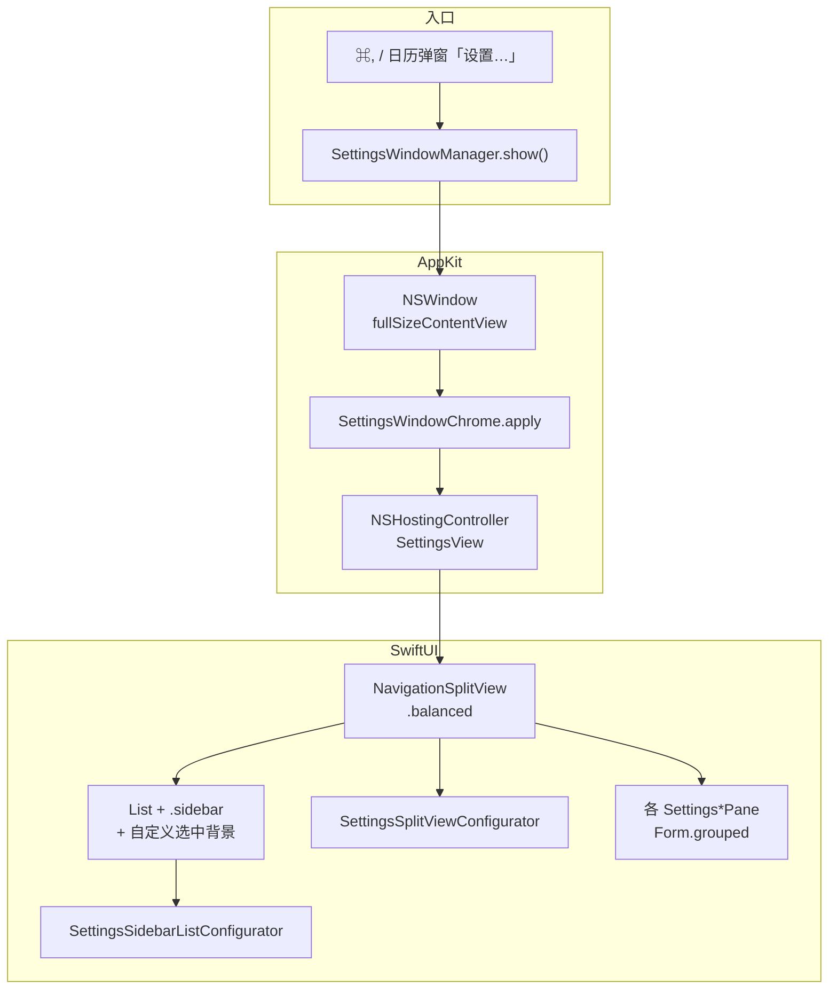

# 设置窗口与全高侧栏实现说明

> 目标：接近 macOS 系统设置 / xCal 的侧栏——毛玻璃材质、交通灯叠在侧栏左上角、选中项内凹圆角高亮。  
> 参考视觉：侧栏全高 + 右侧 `Form(.grouped)` 分组详情。

## 推荐架构（当前采用）

Tic 是 **`LSUIElement` 菜单栏应用**（无 Dock 图标），设置窗口**不能**依赖 SwiftUI 的 `Settings { }` 场景作为主路径，而应使用 **AppKit 窗口 + SwiftUI 内容**。



### 相关文件

| 文件 | 职责 |
|------|------|
| [`SettingsWindowManager.swift`](../Tic/Sources/SettingsWindowManager.swift) | 创建/复用 `NSWindow`，挂载 `NSHostingController` |
| [`Settings/SettingsWindowChrome.swift`](../Tic/Sources/Settings/SettingsWindowChrome.swift) | 窗口级 chrome：透明标题栏、toolbar、全高 split、固定尺寸、禁用最小化/最大化 |
| [`SettingsView.swift`](../Tic/Sources/SettingsView.swift) | `SettingsSection` 枚举、`NavigationSplitView`、侧栏 `List`、详情路由、`SettingsSplitViewConfigurator` |
| [`Settings/SettingsTheme.swift`](../Tic/Sources/Settings/SettingsTheme.swift) | 窗口/侧栏尺寸、行间距、选中圆角；详情区 `SettingsPaneScaffold` |
| [`Settings/SettingsSidebarListConfigurator.swift`](../Tic/Sources/Settings/SettingsSidebarListConfigurator.swift) | 侧栏 `NSTableView`：关闭系统选区高亮，配合 SwiftUI 自定义 `listRowBackground` |
| [`Settings/SettingsSidebarGlassCorner.swift`](../Tic/Sources/Settings/SettingsSidebarGlassCorner.swift) | macOS 26+：侧栏 `NSGlassEffectView.cornerRadius` 与窗口外框同心对齐 |
| [`Settings/SettingsSidebarGlassConfigurator.swift`](../Tic/Sources/Settings/SettingsSidebarGlassConfigurator.swift) | 布局后触发玻璃圆角同步 |
| [`Settings/*SettingsPane.swift`](../Tic/Sources/Settings/) | 各分区详情：`General` / `Appearance` / `MenuBar` / `Calendar` / `Shortcuts` / `About` |

### 设置分区（侧栏 6 项）

`SettingsSection` 定义在 `SettingsView.swift`，侧栏用短标题（控制列宽），详情页大标题在各 Pane 的 `SettingsPaneScaffold` 中：

| 枚举 | 侧栏标题 | 详情 Pane |
|------|----------|-----------|
| `general` | 通用 | `GeneralSettingsPane` |
| `appearance` | 外观 | `AppearanceSettingsPane` |
| `menuBar` | 菜单栏 | `MenuBarSettingsPane` |
| `calendar` | 日历 | `CalendarSettingsPane` |
| `shortcuts` | 快捷键 | `ShortcutsSettingsPane` |
| `about` | 关于 | `AboutSettingsPane` |

入口：`TicApp` 中 `CommandGroup(replacing: .appSettings)`（⌘,）、`CalendarPopoverView` 底部「设置…」——均调用 `SettingsWindowManager.show()`。

### SwiftUI 侧栏（内容层）

```swift
NavigationSplitView(columnVisibility: $columnVisibility) {
    List(selection: $selection) {
        ForEach(SettingsSection.allCases) { section in
            Label(section.sidebarTitle, systemImage: section.icon)
                .tag(section)
                .listRowInsets(SettingsTheme.sidebarRowInsets)
                .listRowSeparator(.hidden)
                .listRowBackground(sidebarSelectionBackground(for: section))
        }
    }
    .listStyle(.sidebar)
    .navigationSplitViewColumnWidth(
        min: SettingsTheme.sidebarMinWidth,
        ideal: SettingsTheme.sidebarWidth,
        max: SettingsTheme.sidebarMaxWidth
    )
    .toolbar(removing: .sidebarToggle)
    .background(SettingsSidebarListConfigurator())
} detail: { /* switch selection → *SettingsPane */ }
.navigationSplitViewStyle(.balanced)
.background(SettingsSplitViewConfigurator())  // 延迟 allowsFullHeightLayout
```

- **不要**用手写 `HStack` 拼侧栏：会失去 `List(.sidebar)` 的毛玻璃与系统列布局，变成纯色块 + 硬分隔线。
- 详情区用 `Form { Section { ... } }.formStyle(.grouped)`，外包 `SettingsPaneScaffold` 大标题（22pt bold + 水平 28pt 内边距）。
- **选中样式**：在保留 `List(.sidebar)` 的前提下，用 SwiftUI `listRowBackground` 画 12pt 圆角（`selectedContentBackgroundColor`），并由 `SettingsSidebarListConfigurator` 将底层 `NSTableView.selectionHighlightStyle = .none`，避免与系统蓝色选区叠在一起。

### AppKit 窗口（chrome 层）

`SettingsWindowChrome.apply` 必须同时配置：

| 配置 | 作用 |
|------|------|
| `styleMask` 含 `.fullSizeContentView` | 内容可画到标题栏区域 |
| `titlebarAppearsTransparent = true` | 透明标题栏 |
| `titleVisibility = .hidden` | 隐藏标题文字（保留无障碍标题 `Tic 设置`） |
| `titlebarSeparatorStyle = .none` | 去掉标题栏底部分隔线 |
| `isMovableByWindowBackground = true` | 可在侧栏空白处拖窗口 |
| `toolbarStyle = .unified` | 与 tracking separator 配合的统一 toolbar |
| `minSize` / `maxSize` 均为 `SettingsTheme`（700×480） | 窗口宽高固定，不可拖拽缩放 |
| `disableAuxiliaryWindowButtons` | 最小化、最大化按钮可见但 `isEnabled = false`（仅关闭可用） |
| `hosting.safeAreaRegions = []` | SwiftUI 不把交通灯区域算进 safe area |
| `NSToolbar` + `.sidebarTrackingSeparator` | 系统把列分隔线画进标题栏，**全高侧栏才生效** |
| `NSSplitViewItem.allowsFullHeightLayout = true` | 侧栏列布局延伸到窗口顶 |

`allowsFullHeightLayout` 在 `apply` 时调用一次，并在 **`SettingsSplitViewConfigurator`**（`updateNSView` → `DispatchQueue.main.async`）与 **`SettingsWindowManager.show()` 首帧后** 再调一次，因 hierarchy 里 `NSSplitViewController` 可能尚未就绪。

新建窗口 `styleMask`：`.titled, .closable, .miniaturizable, .fullSizeContentView`（**不含** `.resizable`，尺寸由 min/max 锁死）。

### 尺寸常量（`SettingsTheme`）

| 常量 | 值 | 说明 |
|------|-----|------|
| `windowWidth` × `windowHeight` | 700 × 480 | 固定窗口 |
| `sidebarWidth`（ideal） | 168 | 适配四字侧栏项 + 图标 |
| `sidebarMinWidth` / `sidebarMaxWidth` | 152 / 188 | 列宽范围 |
| `sidebarSelectionCornerRadius` | 12 | 列表行选中 pill，非侧栏外框 |
| `macOS26ToolbarWindowCornerRadius` | 28 | Tahoe 带 toolbar 窗口外框参考值（玻璃同心计算） |
| `contentMaxWidth` | 460 | 详情表单最大宽度 |

### macOS 15+ 额外修饰

在 `SettingsView` 根视图通过 `SettingsWindowToolbarStyle`：

```swift
.toolbarBackgroundVisibility(.hidden, for: .windowToolbar)  // macOS 15+
.toolbar(removing: .title)
```

macOS 14 回退：`.toolbarBackground(.hidden, for: .windowToolbar)`。

---

## 踩坑记录

### 1. `Settings` 场景 + 隐藏 `Window`（菜单栏应用）

**现象**：`NSApplication _crashOnException`，打开设置即崩溃。

**原因**：`LSUIElement` 仅 `MenuBarExtra` 时，再声明 `Window` + `Settings` 场景，环境/窗口生命周期与菜单栏应用不匹配；社区 workaround（隐藏 Window 置于 Settings 前）在部分系统版本仍不稳定。

**结论**：Tic **只用** `SettingsWindowManager` + `NSWindow`，**不要**在 `TicApp` 里加 `Settings { }` 或用于 workaround 的隐藏 `Window`。

---

### 2. 手写 `HStack` 侧栏

**现象**：侧栏变成纯色灰块、竖线硬分隔、无 vibrancy；与 xCal/系统设置差距大。

**原因**：`List(.sidebar)` 的材质和选中绘制依赖 `NavigationSplitView` / `NSSplitView` 的列布局，脱离后只剩普通 `List`。

**结论**：侧栏必须是 `NavigationSplitView` 第一列 + `.listStyle(.sidebar)`。

---

### 3. 仅有 `fullSizeContentView` 仍无全高侧栏

**现象**：交通灯仍在独立标题条里，侧栏从标题栏下方才开始。

**原因**：

- `NSHostingController` 默认 safe area 把内容顶下去；
- 缺少 `NSToolbar` 的 **`sidebarTrackingSeparator`** 时，系统不知道在标题栏内画列分隔线。

**结论**：`safeAreaRegions = []` + tracking separator toolbar **缺一不可**（见 [Paul Bancarel 一文](https://medium.com/@bancarel.paul/macos-full-height-sidebar-window-62a214309a80)、[WWDC20 10104](https://developer.apple.com/videos/play/wwdc2020/10104/)）。

---

### 4. `NavigationSplitView` + `NSHostingController` ≠ `WindowGroup`

同一套 `NavigationSplitView`，用 `WindowGroup` 打开与用手动 `NSWindow` 打开，默认 chrome **不一致**（侧栏折叠、全高、toolbar 行为）。菜单栏应用只能走后者并显式 `SettingsWindowChrome`。

---

### 5. macOS 26 Liquid Glass 浮动侧栏

**现象**：侧栏像圆角卡片浮在窗口上，与「贴边全高」预期不符；或侧栏玻璃外框圆角小于窗口外框（交通灯上方「套娃」缝隙不均）。

**说明**：macOS 26 上 `NavigationSplitView` 侧栏由系统 `NSGlassEffectView` 绘制，默认 `cornerRadius` 偏小。Tic 在布局后通过 `SettingsSidebarGlassCorner` 按同心公式写入：

`glass.cornerRadius = macOS26ToolbarWindowCornerRadius - inset`（inset 为玻璃相对 `contentLayoutRect` 左上偏移）。

**调参**：`SettingsTheme.macOS26ToolbarWindowCornerRadius`（默认 28）。仍不匹配时微调该常量；macOS 14–25 无此路径。

**SwiftUI 辅助**：根视图 `containerShape(.rect(cornerRadius: …))`（`SettingsMacOS26ContainerShape`）。

---

### 6. API 可用性

| API | 最低版本 |
|-----|----------|
| `toolbarBackgroundVisibility(.hidden, for: .windowToolbar)` | macOS 15 |
| `toolbar(removing: .title)` | macOS 15 |
| `toolbarBackground(.hidden, for: .windowToolbar)` | macOS 14 回退 |
| `safeAreaInset` / `NavigationSplitView` | macOS 14（项目 deployment target） |

---

### 7. 侧栏列表首行与交通灯

列表项应由系统布局在交通灯**下方**；若重叠，微调 inset（历史上曾用 `safeAreaInset(edge: .top)` ~52pt），**不要**给整窗加 `padding.top`（会把右栏详情也顶下去）。

当前依赖 chrome 配置 + 原生 `List` 布局；一般无需额外 top inset。

---

### 8. 自定义圆角选中 vs 系统选区高亮

**现象**：侧栏同时出现系统蓝色选区和自定义圆角灰底，或圆角被裁切。

**原因**：仅改 SwiftUI `listRowBackground` 时，底层 `NSTableView` 仍会绘制 `selectionHighlightStyle`。

**结论**：保留 `List(.sidebar)` + `SettingsSidebarListConfigurator`（`selectionHighlightStyle = .none`、`style = .sourceList`、按侧栏列宽定位 `NSTableView`）。勿为圆角选中而退回手写 `HStack` 侧栏。

---

## 修改检查清单

改动设置 UI 前请确认：

- [ ] 仍使用 `SettingsWindowManager`，未改回 `Settings` 场景
- [ ] 侧栏仍为 `NavigationSplitView` + `List(.sidebar)`
- [ ] 新建/复用窗口后调用 `SettingsWindowChrome.apply`
- [ ] 未删除 `sidebarTrackingSeparator` toolbar
- [ ] 侧栏仍挂载 `SettingsSidebarListConfigurator`（若改选中样式）
- [ ] `SettingsSplitViewConfigurator` 仍在根视图（全高 split 延迟配置）
- [ ] 未在详情列手动 `Color(nsColor: .windowBackgroundColor)` 盖掉系统背景（除非有明确设计需求）
- [ ] Cmd+, 与弹窗内「设置…」均调用 `SettingsWindowManager.show()`
- [ ] 在 macOS 14 与当前主力系统（如 26）各测一次打开/关闭/切换侧栏项
- [ ] 窗口四角/边缘不可拖拽改变尺寸；最小化 / 最大化按钮可见但禁用（仅关闭可用）
- [ ] 新增分区：更新 `SettingsSection`、侧栏 `ForEach`、detail `switch`，并新增 `*SettingsPane.swift`

---

## 参考资料

- [Customizing window styles and state restoration (macOS)](https://developer.apple.com/documentation/swiftui/customizing-window-styles-and-state-restoration-behavior-in-macos)
- [macOS full height sidebar window (Medium)](https://medium.com/@bancarel.paul/macos-full-height-sidebar-window-62a214309a80)
- [Showing Settings from Menu Bar Items (steipete)](https://steipete.me/posts/2025/showing-settings-from-macos-menu-bar-items) — 说明 MenuBarExtra 与 `Settings` 场景的限制
- [Adopting Liquid Glass](https://developer.apple.com/documentation/TechnologyOverviews/adopting-liquid-glass) — macOS 26 侧栏/导航行为变化
